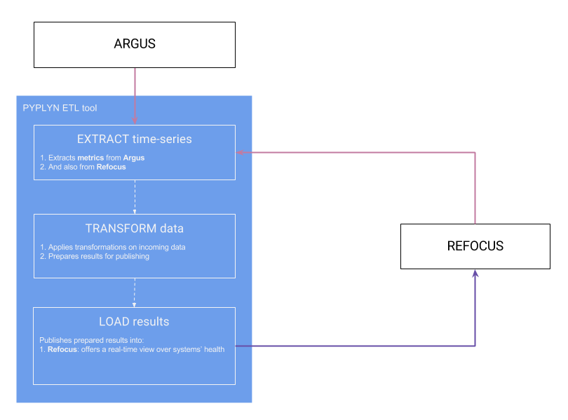

# Introduction [](https://travis-ci.org/salesforce/pyplyn) [](https://scan.coverity.com/projects/salesforce-pyplyn) [](https://stackshare.io/MihaiBojin/pyplyn) [](https://codecov.io/gh/salesforce/pyplyn)


Pyplyn (meaning _*pipeline*_ in [Afrikaans](https://translate.google.com/#af/en/pyplyn)) is an open source tool that 
extracts data from various sources, transforms and gives it meaning, and sends it to other systems for consumption.

Pyplyn was written to allow teams in Salesforce to power real-time health dashboards that go beyond one-to-one mapping 
of time-series data to visual artifacts.

One example of such an use-case is ingesting time-series data stored in [Argus](https://github.com/Salesforce/Argus) 
and [Refocus](https://github.com/Salesforce/refocus), processing multiple metrics together (context), 
and displaying the result in Refocus (as red, yellow, or green lights).




# Features

- Simple and reliable data pipeline with support for various transformations
- **No code required**, JSON-based syntax
- Flexible multi-stage source/transformation/destination logic
- Developed with support for extension via easy-to-grasph Java code
- Highly available and scalable (the pipeline can be partitioned across multiple node)
- Configurations can be added/updated/removed without restarting the process
- Publishes operational metrics (errors, p95, etc.) for monitoring service health


## Improvements from release 9.x

- Faster processing speed with the use of RxJava (4.3x faster, tested on our reference dataset)
- Cleaner code, mainly after converting models *Immutables*-annotated abstract classes
- Support mutual TLS authentication for endpoints, by specifying a Java keystore and password
- Connect, read, and write timeouts can now be specified for each *connector*
- All *Jackson*-based models can now be serialized (with the *type* specifier field)
- `AppConfig.Global.minRepeatIntervalMillis` was deprecated (replaced with `AppConfig.Global.runOnce`)
- Bash script for managing the service's lifecycle (start, stop, restart, logs, etc.)
- Since *10.0.0*, Pyplyn releases follow [Semantic versioning](http://semver.org/) guidelines.


## Roadmap

- Extract source: [Execute a Salesforce SOQL query](https://developer.salesforce.com/docs/atlas.en-us.api_rest.meta/api_rest/dome_query.htm)
- Load destination: Email (via SMTP MTA)
- Load destination: [Post a Salesforce Chatter Feed Item](https://developer.salesforce.com/docs/atlas.en-us.chatterapi.meta/chatterapi/quickreference_post_feed_item.htm)
- Load destination: [Create a Salesforce Record](https://developer.salesforce.com/docs/atlas.en-us.api_rest.meta/api_rest/dome_sobject_create.htm)
- API for managing configurations
- API for managing connectors
- Multi-tenancy (support configurations and connectors belonging to different users)
- Include Pyplyn in the [Maven central](https://search.maven.org/) repository

We welcome ideas for improvement and bugs and as such **we encourage you to submit** them by [opening new issues on GitHub](https://github.com/salesforce/pyplyn/issues/new)!


# Running pyplyn

Pyplyn uses Maven for its build lifecycle.  At least you will need to have [Maven](https://maven.apache.org/) 
and [Java 8](http://www.oracle.com/technetwork/java/javase/overview/index.html) installed on your host OS.

Consult the full [prerequisites](https://salesforce.github.io/pyplyn/#prerequisites) section to find out more.

```bash
# Clone the Pyplyn repository
git clone https://github.com/salesforce/pyplyn /tmp/pyplyn

# Build the project with Maven
cd /tmp/pyplyn
mvn clean package

# Navigate to Pyplyn's build location
cd target/

# Create a new directory for your configurations (leave empty for now)
mkdir configurations

# Rename app-config.example.json and make the required changes
mv config/app-config.example.json config/pyplyn-config.json

# Rename connectors.example.json and make the required changes (see below)
mv config/connectors.example.json config/connectors.json

# Update the _connectors.json_ file and configure your endpoints
#

# Edit bin/pyplyn.sh and set _LOCATION_ to the absolute path of the build directory
#   LOCATION=/tmp/pyplyn/target

# Start pyplyn and check logs
bash bin/pyplyn.sh start

# Check that the program started without throwing any exceptions
bash ~/pyplyn/bin/pyplyn.sh logs
```

A full step-by-step explanation (including how to write configurations) can be found in the [Pyplyn documentation](https://salesforce.github.io/pyplyn/#quickstart).


# Next steps?

Consult the [Pyplyn Documentation](https://salesforce.github.io/pyplyn/) for an in-depth explanation of Pyplyn's features. 

Generate *Javadocs* by running the following Maven target: `mvn package`.

If you would like to contribute to Pyplyn, please read the [contributor guide](CONTRIBUTE.md)!


# Thank you!
