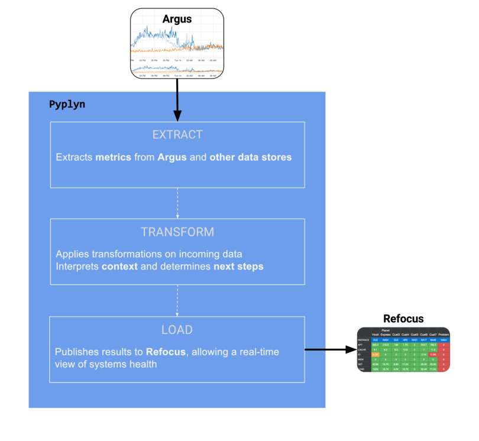
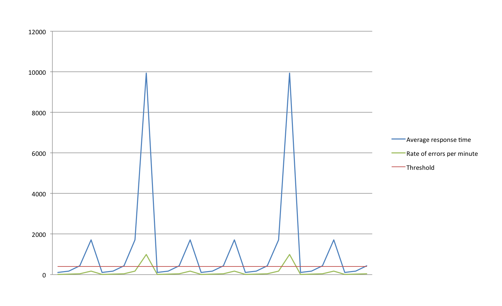

# Introduction


Pyplyn (meaning _*pipeline*_ in [Afrikaans](https://translate.google.com/#af/en/pyplyn)) is an open source tool that 
extracts data from various sources, transforms and gives it meaning, and sends it to other systems for consumption.

Pyplyn was written to allow teams in Salesforce to power real-time health dashboards that go beyond one-to-one mapping of time-series data to visual artifacts.

One example of such a use case is ingesting time-series data stored in [Argus](https://github.com/Salesforce/Argus) and [Refocus](https://github.com/Salesforce/refocus), processing multiple metrics together (with context), and displaying the result in Refocus (as red, yellow, or green lights).




# What does Pyplyn solve?

A time-series of historical data works well for understanding the evolution of metrics over time, but it doesn't give you much help when it comes to explaining what the data means _right now_.

Take a look at the following example:



This chart shows two metrics and a threshold. But, at a glance, it doesn't really tell you if there's a problem or not. Your attention is drawn towards the two spikes, which may or may not be the most relevant thing. It's also not clear what the _threshold_ applies to: is the errors per minute, or the response time? (And, is the _average_ response time above or below the threshold?)

Providing enough information to allow engineers to determine _**health**_, using line charts alone, is a tall order. In most cases, it requires too much visual interpretation to be helpful in a time-critical situation.

This is where [Refocus steps in](https://medium.com/salesforce-open-source/take-a-moment-to-refocus-86b6546c90c#c169), and **why Pyplyn exists**: to complement Refocus's visualization capabilities by providing a robust pipeline that feeds dashboards with fresh data.


# Overview


## Key features

- Simple and reliable data pipeline with support for various transformations
- **No code required** - Uses a JSON-based syntax
- Flexible multi-stage source/transformation/destination logic
- Developed with support for extension via easy-to-grasp Java code
- Highly available and scalable (the pipeline can be partitioned across multiple nodes)
- Configurations can be added/updated/removed without restarting the process
- Publishes operational metrics (errors, p95, etc.) for monitoring service health

## Improvements from release 11.x

- Deprecation of the unloved refocus-batcher
- Staggered execution of work to reduce strain on downstream systems
- Automatic log rotation and compression to avoid disk space issues
- Fixes for user-reported bugs
- Support for more customizable thresholds (LESS_THAN_OR_EQ, EQUAL_TO, GREATER_THAN_OR_EQ)
- More robust key refreshing for Argus endpoint

## Planned developments

### Breaking changes

- REST API that handles upload, management, and deletion of configurations
- Connection with a PostgreSQL database
- Ability to read configurations locally or from database

### Roadmap

- Auditable alerts
- Alerts analytics API
- Configuration-level metadata
- Datacenter and instance wildcard expansion

# Concepts

Let's start with an overview of a few basic concepts in Pyplyn.

## AppConfig

The [AppConfig](https://github.com/salesforce/pyplyn/blob/master/duct/src/main/java/com/salesforce/pyplyn/duct/appconfig/AppConfig.java) represents the primary object used to configure Pyplyn's behavior (endpoint connectors, the path to configurations, self-monitoring alerting threshold, and high-availability settings).

The application config has four sections: *global*, *alert*, *hazelcast*, and *database*; they are explained below.


## AppConfig.Global

```json
{
  "global": {
    "configurationsPath": "/path/to/configurations/dir",
    "connectorsPath": "/path/to/connectors.json",
    "updateConfigurationIntervalMillis": 300000,
    "runOnce": false,
    "dataSource": "fileSystem"
  },

  "alert": {
    "checkIntervalMillis": 60000,
    "enabled": true,
    "thresholds": {
      "MeterNameMeterTypeStatusCode": 1.0
    }
  },

  "hazelcast": {
    "config": "/hazelcast.xml",
    "enabled": false
  }
}
```

This is the only mandatory section of the *AppConfig*. See the following explanations as to what each of these parameters does:

Parameter | Default | Description
--------- | ------- | -----------
configurationsPath | null | This should point to a directory which contains the Pyplyn [configurations](#configurations) to process *if using local file system*
connectorsPath | required, string | A single JSON file which lists service endpoint [connectors](#connectors) used by Pyplyn's plugin to extract data and push results
updateConfigurationIntervalMillis | required | The number of milliseconds at which Pyplyn periodically reloads all configurations from disk (if any configurations are removed from this directory, they will no longer be processed after the configuration update process' next run)
ioPoolsThreadSize | 100 | Defaults to 100 threads per IO pool; can be updated to increase or decrease the number of threads in the dedicated *Extract* and *Load* thread pools (for tweaking performance depending on the deployment hosts)
runOnce | false | Defaults to false, which means the service runs indefinitely or until terminated by the host OS; set to true to process the specified configurations only once, then exit (useful if you want to run Pyplyn with `crontab`, or for testing)
dataSource | fileSystem | Specifies the source of the configurations. If `fileSystem`, checks *configurationsPath* for configuration files. If `database`, relies on parameters in [AppConfig.Database](#appconfig-database) to know where the database is.


## AppConfig.Alert

> Pyplyn will report a status of *CRITICAL* if it registers less than 25 successful Refocus extract operations in the specified *checkIntervalMillis*

```json
"RefocusExtractSuccessCRIT": 25.0
```

> Pyplyn will report a status of *WARNING* if it registers *more than* 25 failed Refocus authentication attempts in the specified *checkIntervalMillis*

```json
"RefocusAuthenticationFailureWARN": 5.0
```

> The **less than / more than** logic is determined by the corresponding **MeterType** (e.g., *ExtractSuccess* and *AuthenticationFailure*).

This section is used to configure Pyplyn's health metrics and monitoring.

Parameter | Default | Description
--------- | ------- | -----------
checkIntervalMillis, integer | optional | The number of milliseconds at which Pyplyn checks its health, based on internally collected metrics, and outputs its status; defaults to 300,000 ms (5 minutes)
enabled | optional, boolean | Defaults to *false*; set to *true* to have Pyplyn output its health to the system's console
thresholds | optional, object | A `Map<String, Double>`, specifying alerting thresholds for various parts of the system (more below); if not specified, it will default to an empty map

The key specified in the *thresholds* map determines each value's scope.  The names are formed by concatenating three identifiers:

1\. `MeterName`: points to the type of service being queries, e.g., Argus, Refocus, InfluxDB, etc.
2\. `MeterType`: an enumeration of available operation types, defined in [MeterType.java](https://github.com/salesforce/pyplyn/blob/master/plugin-api/src/main/java/com/salesforce/pyplyn/status/MeterType.java); each type also defines the logic to use for comparison (*GREATER_THAN* or *LESS_THAN*)
3\. `StatusCode`: [StatusCode.java](https://github.com/salesforce/pyplyn/blob/master/plugin-api/src/main/java/com/salesforce/pyplyn/model/StatusCode.java)


## AppConfig.Hazelcast

> Configure the username and password to use (limiting access to the cluster to authorized parties)

```xml
<group>
  <name>USERNAME</name>
  <password>PASSWORD</password>
</group>
```

> Add the list of members that make up the cluster, as `<member/>` entries (one host per line)

```xml
    <network>
        <join>
            <tcp-ip enabled="true">
                <member>127.0.0.1</member>
            </tcp-ip>
        </join>
    </network>
```

Parameter | Default | Description
--------- | ------- | -----------
enabled | optional, boolean | Defaults to *false*; set to *true* to allow Pyplyn to work in a multi-node [Hazelcast](https://hazelcast.org/) clustering
config | required, string | Specifies the path to an XML used to configure the cluster. The available options are described in detail Hazelcast's [documentation](http://docs.hazelcast.org/docs/3.8.1/manual/html-single/index.html)

To run Pyplyn in cluster mode, take a look at the [hazelcast.example.xml](https://github.com/salesforce/pyplyn/blob/master/blob/master/duct/src/main/resources/hazelcast.example.xml) configuration file.

## AppConfig.Database

The options defined here help Hibernate figure out how to facilitate the connection between Pyplyn and the database.

Parameter | Default | Description
--- | --- | ---
url | required | JDBC URL
bytecodeReflectionOptimizer | true | Enables the use of CGLIB instead of runtime reflection (System-level property). Reflection can sometimes be useful when troubleshooting. Hibernate always requires CGLIB even if you turn off the optimizer. 
driverClass | org.postgresql.Driver | JDBC Driver
appUserSecretKey | null | The secret key for the app user (regular permissions)
adminUserSecretKey | null | The secret key for the admin user (heightened permissions)
appUser | null | The username for the app user (regular permissions)
adminUser | null | The username for the admin user (heightened permissions)
appUserPassword | null |
adminUserPassword | null |
dialect | org.hibernate.dialect.PostgreSQL82Dialect | The classname of a Hibernate org.hibernate.dialect.Dialect which allows Hibernate to generate SQL optimized for a particular relational database.
showSql | true | Write all SQL statements to console. This is an alternative to setting the log category org.hibernate.SQL to debug.
timezone | UTC | The timezone used for persistence statistics in the database (namely, last_updated and created_date)
lazyLoad | true | "Lazy loading" means that an entity will be loaded only when you actually accesses the entity for the first time.
currentSessionContext | thread | Supply a custom strategy for the scoping of the "current" Session. See [this writeup](https://docs.jboss.org/hibernate/orm/3.3/reference/en-US/html/architecture.html#architecture-current-session) for more information about the built-in strategies.
formatSql | true | Pretty print the SQL in the log and console. e.g. true | false
useSqlComments | true | If turned on, Hibernate will generate comments inside the SQL, for easier debugging, defaults to false.
onStartup | update | Determines what happens to the schema on creation. Options include validate, update, create, and create-drop.

## Connectors

> Refocus: without authentication

```json
{
  "id": "refocus-without-authentication",
  "endpoint": "https://url-to-your-refocus-instance/v1/"
}
```


> Refocus: username and password
> **Remember: all passwords need to be [BASE64-encoded](#base64-mime-encoding)**!

```json
{
  "id": "refocus-user-and-pass",
  "endpoint": "https://url-to-your-refocus-instance/v1/",
  "username": "username",
  "password": "BASE64-encoded-password-string"
}
```


> Argus: username and password

```json
{
  "id": "argus",
  "endpoint": "https://url-to-your-argus-instance/argusws/",
  "username": "username",
  "password": "BASE64-encoded-password-string"
}
```


> Argus: with custom timeouts (30/40/50 seconds)

```json
{
  "id": "argus",
  "endpoint": "https://url-to-your-argus-instance/argusws/",
  "username": null,
  "password": "BASE64-encoded-Argus-refresh-token",
  "connectTimeout": 30,
  "readTimeout": 40,
  "writeTimeout": 50
}
```

Endpoint connectors are collections of settings that define a remote host to/from which data can be pushed, or loaded.

Each connector should be defined in the _connectors.json_ file; see the available parameter list below:

Parameter | Default | Description
--------- | ------- | -----------
id | required, string | Unique identifier used in various Pyplyn objects, to refer to this endpoint
endpoint | required, string | The URL of the service represented by this connector
username | optional, string | Username used for authentication, or null if not required
password | optional, string | Password required for authenticating to this endpoint, or null if not required; this string **should be [BASE64 encoded](#base64-mime-encoding)**
proxyHost | optional, string | A hostname pointing to an HTTP proxy, or null if not used
proxyPort | optional, integer | The port the proxy listens on, or null if not used
connectTimeout | optional, integer | How long to wait for connections to initialize; defaults to 10 seconds
readTimeout | optional, integer | How long to wait for reads from the endpoint; defaults to 10 seconds
writeTimeout | optional, integer | How long to wait for writes from the endpoint; defaults to 10 seconds
keystorePath | optional, string | Used for mutual TLS authentication; should point to a Java keystore file holding the client certificate
keystorePassword | optional, string | Password used to access the Java keystore for mutual authentication; this string **should be [BASE64 encoded](#base64-mime-encoding)**
sslContextAlgorithm | optional, string | Specifies the [algorithm](http://docs.oracle.com/javase/8/docs/technotes/guides/security/StandardNames.html#SSLContext) to use for opening secure connections to this endpoint; if not specified, defaults to **TLSv1.2**


## Token-based authentication

> Refocus: JWT token

```json
{
  "id": "refocus-api-connector",
  "endpoint": "https://url-to-your-refocus-instance/v1/",
  "username": null,
  "password": "BASE64-encoded-Refocus-token"
}
```


> Argus: refresh token

```json
{
  "id": "argus-api-connector",
  "endpoint": "https://url-to-your-argus-instance/argusws/",
  "username": null,
  "password": "BASE64-encoded-Argus-refresh-token"
}
```

Both Argus and Refocus support authentication with tokens. This is generally more secure than the username / password method (which exposes a larger attack surface).

Read more about Argus's [token-based authentication](https://github.com/salesforce/Argus/wiki/Token-Based-Authentication) and Refocus's [security](https://salesforce.github.io/refocus/docs/10-security.html) page.

<aside class="notice">In Pyplyn, token-based authentication to external systems is supported by defining the <strong>username as _null_</strong> in combination with a <strong>BASE64-encoded token value</strong> specified as a password value.</aside>


## Mutual TLS authentication

> Argus: with mutual TLS authentication

```json
{
  "id": "argus-api-connector",
  "endpoint": "https://url-to-your-argus-instance/argusws/",
  "keystorePath": "/path/to/keystore.jks",
  "keystorePassword": "password-in-clear-text",
  "sslContextAlgorithm": "TLSv1.2"
}
```

Additionally, Pyplyn supports sending a *client TLS certificate*, to be used as proof of identity when communicating with remote systems.  To do that, define the following parameters in your connector:

Parameter | Default | Description
--------- | ------- | -----------
keystorePath | required, string | The value should point to a Java keystore file holding the client TLS certificate
keystorePassword | required, string | The password used to access keystore file; this string **should be [BASE64 encoded](#base64-mime-encoding)**
sslContextAlgorithm | optional, string | Specifies the [algorithm](http://docs.oracle.com/javase/8/docs/technotes/guides/security/StandardNames.html#SSLContext) to use for opening secure connections to this endpoint; if not specified, defaults to **TLSv1.2**


## Configurations

> Example of a configuration object:

```json
{
  "repeatIntervalMillis" : 60000,
  "extract" : [
    {
      "format" : "Argus",
      "endpoint" : "argus-api-connector",
      "cacheMillis" : 120000,
      "defaultValue" : 0.0,
      "expression" : "SUM(-6m:-1m:scope:metric{tags}:avg:1m-max,#1m#)",
      "name" : "argus-result-name"
    }
  ],
  "transform" : [
    {
      "name" : "LastDatapoint"
    },
    {
      "name" : "Threshold",
      "criticalThreshold" : 500.0,
      "warningThreshold" : 100.0,
      "infoThreshold" : 100.0,
      "type" : "GREATER_THAN",
      "applyToMetricName" : "argus-result-name"
    }
  ],
  "load" : [
    {
      "format" : "Refocus",
      "endpoint" : "refocus-default",
      "subject" : "root.subject.path",
      "aspect" : "AN_ASPECT",
      "relatedLinks" : [
        {
          "name": "Link title",
          "url": "https://path/to/your/site"
        }
      ]
    }
  ]
}
```

A Pyplyn [Configuration](https://github.com/salesforce/pyplyn/blob/master/plugin-api/src/main/java/com/salesforce/pyplyn/configuration/Configuration.java) is an encompassing model that represents processing logic: where the input data originates from (*extract*),
how it should be processed (*transform*), and where it should be published to (*load*).

Configurations are loaded from a directory specified in `AppConfig.configurationsPath`.  Each file contains an array of zero or more configurations.  During startup and periodically at the duration specified in `AppConfig.Global.updateConfigurationIntervalMillis`, all `.json` files in this directory are deserialized and all configurations are loaded for processing.

<aside class="notice">From a functional standpoint, there is no difference if you structure all your configurations in a single file, or you create one file for each configuration.</aside>

The configuration object's parameters are explained below:

Parameter | Default | Description
--------- | ------- | -----------
repeatIntervalMillis | required, integer | The frequency at which the configuration is executed.  Currently, the implementation does not allow configuration runs to overlap (the same configuration will not be executed until a previous run finishes processing).
extract | required, array | Array of sources from which data is to be extracted.  See the [data sources](#data-sources) section below.
transform | required, array | Array of transformation plugins that are applied sequentially to the incoming data.  See the [Transformations](#transformations) section for details on available classes and their functionality.
load | required, array | Array which specifies the destination to where the transformed data is to be sent.  See the [Load destinations](#load-destinations) section for additional details.
disabled | optional, boolean | Set to *false* by default; if set to *true*, the configuration will not be processed, allowing for easy management of configuration objects, without having to delete them from Pyplyn's `configurations` directory.

<aside class="notice">Pyplyn was built with extensibility in mind.  If you find that the included list of <em>extract</em>, <em>transform</em>, and <em>load</em> implementations are not sufficient, you can easily define new ones;  consult the <a href="#extending-pyplyn">extending Pyplyn</a> section for more details!</aside>

## Uploading Configurations via REST API

Beginning in version *13.x.x*, Pyplyn will accept configurations via a web url.

Endpoint | Operation | Request | Response | Description
--- | --- | --- | --- | ---
/v1/configurations | POST | JSON list of configurations | X records created successfully | Upload a list of configurations; creates new records in database
/v1/configurations | GET | | JSON list of configurations | Retrieve all configurations for your user
/v1/configurations/{id} | GET | | Configuration with specified id | Retrieve a particular configuration
/v1/configurations/{id} | PUT | JSON Configuration | | Update a particular configuration
/v1/configurations/{id} | DELETE | | | Delete a particular configuration

## Transmutation

A [Transmutation](https://github.com/salesforce/pyplyn/blob/master/blob/master/plugin-api/src/main/java/com/salesforce/pyplyn/model/Transmutation.java) is the model representing data as it flows through and is transformed by Pyplyn's plugins.


# Data sources

## Argus

```json
"extract" : [
  {
    "format" : "Argus",
    "endpoint" : "argus-api-connector",
    "expression" : "SUM(-6m:-1m:scope:metric{tags}:avg:1m-max,#1m#)",
    "cacheMillis" : 120000,
    "defaultValue" : 0.0,
    "name" : "argus-result-name"
  }
]
```

Argus is a time-series data collection, visualization, and monitoring service that provides both near-real-time and historical insights to your enterprise data. 

Any [metric](https://github.com/salesforce/Argus/wiki/Metric) can be retrieved by specifying a few parameters:

Parameter | Default | Description
--------- | ------- | -----------
endpoint | required, string | Identifies the connector to use (the connection on which this expression will be run on); read more in the (connectors)[#connectors] section
expression | required, string | An Argus expression used to load and [transform](https://github.com/salesforce/Argus/wiki/Transforms) [metrics](https://github.com/salesforce/Argus/wiki/Metrics)
cacheMillis | optional, integer | How long to cache this expression's results (in ms); if the same *expression* is queried on the same *endpoint* before this duration expires, the first (cached) result will be returned
defaultValue | optional, double | If no results are returned from the endpoint, having this parameter specified causes the processor to generate one data point with this value and the time set to the moment of execution
name | required, string | Used to identify the time series returned by the specified expression, in downstream *transforms*


## InfluxDB

```json
"extract" : [
  {
    "format" : "InfluxDB",
    "endpoint" : "influxdb-database-name",
    "query" : "SELECT time, value FROM a_measurement WHERE time >= now() - 1m",
    "name" : "influxdb-result-name"
  }
]
```

[InfluxDB](https://www.influxdata.com/time-series-platform/influxdb/) is a time-series data store that can store and query large amounts of time-stamped data.

Parameter | Default | Description
--------- | ------- | -----------
endpoint | required, string | Identifies the connector to use; for InfluxDB, this should match the [database name](https://docs.influxdata.com/influxdb/v1.3/guides/querying_data/#querying-data-using-the-http-api) where the queried measurement exists
query | required, string | Represents the measurement to load data for; Please ensure the **time** and **value** columns are included, by writing your queries as: `SELECT * ...` or `SELECT time, value ...`, as the extract processor assumes the existence of *time* and *value* when mapping the results.
name | required, string | Used to identify the time series returned by the specified expression in downstream *transforms*

<aside class="notice">At the moment, the <strong>InfluxDB</strong> implementation in Pyplyn <strong>does not support authentication!</strong></aside>

## Refocus

```json
"extract" : [
  {
    "format" : "Refocus",
    "endpoint" : "refocus-api-connector",
    "subject" : "USA.California.*",
    "actualSubject" : "USA.California.San_Francisco",
    "aspect" : "Population",
    "cacheMillis" : 120000,
    "defaultValue" : 0.0
  }
]
```

> *Wildcards* can be used in combination with *cacheMillis*, to retrieve and cache all subjects with a determined parent (`USA.California`) and then return only the value named by `actualSubject` (`San_Francisco`); see the example below:

```json
{
  "format" : "Refocus",
  "subject" : "USA.California.*",
  "actualSubject" : "USA.California.San_Francisco",
  "cacheMillis" : 120000,
}
```

Refocus gives engineers a high-level overview over the health and status of systems and services.  Data can not only be uploaded (see the [Refocus load destination](#refocus-as-a-destination) section for more details) but also extracted.

The following parameters show how [samples](https://salesforce.github.io/refocus/docs/01-quickstart.html#sample) can be extracted from Refocus:

Parameter | Default | Description
--------- | ------- | -----------
endpoint | required, string | Identifies the connector to use (the connection on which this expression will be run on); read more in the (connectors)[#connectors] section
subject | required, string | Represents the subject to load; this can either be a full subject name (`USA.California.San_Francisco`) or a wildcard, e.g., `USA.California.*`
actualSubject | optional, string | Specified only if a wildcard was used for *subject*; it will identify the actual value to return, e.g., `USA.California.San_Francisco`
aspect | required, string | The aspect whose value you want to retrieve, e.g., `Population`
cacheMillis | optional, integer | How long to cache this expression's results (in ms); if the same *subject* and *aspect* are queried on the same *endpoint* before this duration expires the (cached) result set will be used to return the value named by `actualSubject`
defaultValue | optional, double | If no results are returned from the endpoint, having this parameter specified causes the processor to generate one data point with this value and the time set to the moment of execution


# Transformations

## HighestValue

```json
"extract": [
  {
    "format": "Argus",
    "expression": "-2m:-1m:metric1",
  },
  {
    "format": "Argus",
    "expression": "-2m:-1m:metric2",
  }
],
"transform": [
  {
    "name": "HighestValue",
    "messageCodeSource" : "ORIGINAL_VALUE",
    "tagMessageBody" : "ORIGINAL_TIMESTAMP"
  }
]
```

This transformation is effective in retrieving the most critical value from a set of sources.  For example, consider the example configuration >>>

If *metric1* would return **1.0** and *metric2* would return **2.0**, applying **HighestValue** would result in a single data point of *metric2*=**2.0**.

### Parameters

Parameter | Default | Description
--------- | ------- | -----------
messageCodeSource | optional, string | This parameter can either be skipped or assigned to a string value of *"ORIGINAL_VALUE"*; if specified, it will result in setting the `Transmutation.Metadata#messageCode` to the corresponding value (for each result), formatted to five characters-max; NOTE: any values between minus one and one (-1,1) will be evaluated as zero (0)
tagMessageBody | optional, string | This parameter can either be skipped or set to a string value of *"ORIGINAL_TIMESTAMP"*; if set, it will result in the value's timestamp to be added to `Transmutation.Metadata#messages`

This plugin is used in combination with [Threshold](#threshold).  Together they can achieve the effect of grouping multiple time series together, interpreting which has the most urgency (based on their status), and displaying that as a single Refocus ASPECT.

<br/>

<aside class="notice">What is a <strong>Transmutation's Metadata</strong> ?</aside>

> Assume the following time series are processed with the *HighestValue* transform (with both *messageCodeSource* and *tagMessageBody* flags set):

```bash
# time series
USA.California.San_Francisco|TEMPERATURE=[{time: "1507047897", value: "60"}]
USA.California.Los_Angeles|TEMPERATURE=[{time: "1507032000", value: "68"}]

# apply HighestValue
USA.California.Los_Angeles|TEMPERATURE=[68]

# the resulting Transmutation will contain the following values:
- time: 1507032000
- name: USA.California.Los_Angeles|TEMPERATURE
- value: 68.0
- metadata:
  - messageCode="68.0"
  - messages:
    - Original time: 2017-10-03T12:00:00Z
```


As data flows through Pyplyn, metadata can be added to offer [Load destinations](#load-destinations) more context about state transformations.  Metadata is captured in each [Transmutation](#transmutation) object that is returned by various *transform* plugins.

An explanation of how the *HighestValue* plugin achieves this behavior can be seen in the example to the right:


## InfoStatus

```json
"extract": [
  {
    "name" : "InfoStatus"
  }
]
```

Since *OK* statuses are not displayed by default in [Refocus](#refocus), you can use this plugin to remap values of zero to **one** (1.0).  This plugin should be included after the [Threshold](#threshold) plugin and assumes that the target Refocus aspects are configured such as [described here](#refocus-aspect).


## Metadata

```json
"extract": [
  {
    "name" : "Metadata"
    "tags": {
      "key": "value"
    }
  }
]
```

This plugin allows you to define (key, value) pairs to be included in each [transmutation](#transmutation)'s metadata.

<aside class="warning">The default behavior is to override any previously defined tags (e.g., by including the <em>Metadata</em> plugin multiple times.</aside>

<aside class="notice">This plugin is not used by any transform plugins or load destinations in the current release (10.x.x).</aside>


## LastDatapoint

```json
{
  "name" : "LastDatapoint"
}
```

This plugin filters out a time-series result, returning only the most recent value. For example, imagine a time-series is an array of values, as seen in the example to the right:

```
input: [1, 2, 3, 4, ..., 100]
output: [100]
```


## SaveMetricMetadata

```json
{
  "name" : "SaveMetricMetadata"
}
```

> Assume the following two time series are processed with the *LastDatapoint*, *HighestValue* and *SaveMetricMetadata* transforms:

```bash
# time series
USA.California.San_Francisco|TEMPERATURE=[50, 60, 60]
USA.California.Los_Angeles|TEMPERATURE=[60, 70, 60, 68]

# apply LastDatapoint
USA.California.San_Francisco|TEMPERATURE=[60]
USA.California.Los_Angeles|TEMPERATURE=[68]

# apply SaveMetricMetadata (more below)

# apply HighestValue
USA.California.Los_Angeles|TEMPERATURE=[68]

# without SaveMetricMetadata, only one of the two metrics would be included

# with SaveMetricMetadata, all the metrics' values would be included as metadata
USA.California.Los_Angeles|TEMPERATURE=[68]
Metadata:
  USA.California.San_Francisco|TEMPERATURE = 60
  USA.California.Los_Angeles|TEMPERATURE = 68
```

This functionality can be useful when using a combination of multiple [extract](#sources) and the [HighestValue](#highestvalue) plugin, which computes the result by choosing the most critical source, but does not include any information about the other ones.

Use *SaveMetricMetadata* to include key-value pairs of (name, value) for each source.  These are captured as [transmutation](#transmutation) metadata messages.


## Threshold

```json
{
  "name" : "Threshold",
  "criticalThreshold" : 500.0,
  "warningThreshold" : 100.0,
  "infoThreshold" : 100.0,
  "type" : "GREATER_THAN"
}
```

The *Threshold* plugin can be used to customize and give meaning to the status of a series of metrics, taking their context into account.

It works by bucketing the four statuses as integers ranging from 0 to 3, which in-turn can be interpreted by Load destinations such as [Refocus](#refocus-as-a-destination).

### Parameters 

Parameter | Default | Description
--------- | ------- | -----------
type | optional, string | Can be set to GREATER_THAN, LESS_THAN to define how values are compared against the specified threshold parameters;  If a *type* is not specified, it will cause the plugin to return the same inputs that it was passed
criticalThreshold | optional, double | Determines where the CRIT interval starts; leave null to skip
warningThreshold | optional, double | Determines where the WARN interval starts; leave null to skip
infoThreshold | optional, double | Determines where the INFO interval starts; leave null to skip
okThreshold | optional, double | Determines what makes an OK status
applyToMetricName | optional, string | If specified, the current transform will only be applied to `Transmutation`s whose name matches this value

<aside class="notice">Thresholds are evaluated from most critical to least critical. The first one that matches is returned.  There is no validation performed so that the values of CRIT, WARN, INFO, and OK are in strictly descending or ascending order! </aside>

<aside class="notice">In this context, GREATER_THAN and LESS_THAN are inclusive of the value; e.g., GREATER_THAN 0 means greater than or equal to zero!</aside>

<aside class="notice">A great deal of flexibility can be achieved by skipping some of the thresholds; for example setting <em>criticalThreshold=null</em>, will cause the configuration to at most set a <em>WARN</em> status.</aside>


## ThresholdMetForDuration

```json
{
  "name" : "ThresholdMetForDuration",
  "type" : "GREATER_THAN",
  "threshold" : 80.0,
  "criticalDurationMillis" : 120000,
  "warnDurationMillis" : 60000,
  "infoDurationMillis" : 30000
}
```

Similar to the [Threshold](#threshold) plugin, with the difference that this plugin determines the status of a data point by the duration for which a certain value was exceeded (or fell behind).

### Parameters 

Parameter | Default | Description
--------- | ------- | -----------
type | required, string | Can be set to GREATER_THAN, LESS_THAN to define how values are compared against the specified threshold parameter
threshold | required, double | The value which a value has to exceed or fall behind, depending on the chosen *type*
criticalDurationMillis | required, double | Determines how long the threshold has to be exceeded to return a status of CRIT
warnDurationMillis | required, double | Determines how long the threshold has to be exceeded to return a status of WARN
infoDurationMillis | required, double | Determines how long the threshold has to be exceeded to return a status of INFO

<aside class="notice">In this context, GREATER_THAN and LESS_THAN are inclusive of the value; e.g., GREATER_THAN 0 means greater than or equal to zero!</aside>


# Load destinations

At this time *Pyplyn* only supports publishing results to Refocus.  More load destinations are planned in a [future release](#planned-future-changes).  

You can, however, make use of Pyplyn's ability to post the same results to multiple destinations, and publish to more than one Refocus endpoint!


## Refocus as a destination

> For a subject of *USA.California.San_Francisco* and an aspect of *Population*, the Pyplyn *load* section of the configuration would look as follows:

```json
"load": [
  {
    "format" : "Refocus",
    "endpoint" : "refocus-default",
    "subject" : "USA.California.San_Francisco",
    "aspect" : "Population",
    "relatedLinks" : []
  }
]
```

Refocus is a platform for visualizing the health and status of systems and services.  Data in Refocus is represented by [Samples](https://salesforce.github.io/refocus/docs/01-quickstart.html#sample), which point to the value of an [aspect](https://salesforce.github.io/refocus/docs/01-quickstart.html#aspect) for a specified [subject](https://salesforce.github.io/refocus/docs/01-quickstart.html#subject) at a given point in time (which is usually, very close to real-time).

Subjects introduce the concept of paths, where each can have multiple parents forming a 1:N relationship and allowing developers to structure the resulting dashboard in a way that makes sense for the observed system.

See the [Refocus configuration](#setting-up-refocus) section below, to read about how aspects can be defined in Refocus, to be used in combination with the [Threshold](#threshold) plugin.

<aside class="notice">A Refocus sample's name is always formed by concatenating its subject path and aspect and using the 'pipe' character to separate them, e.g., <strong>USA.California.San_Francisco|Population</strong></aside>

### Parameters

Parameter | Default | Description
--------- | ------- | -----------
format | required, string | Should be set to "Refocus"
endpoint | required, string | Identifies the connector to use when uploading this sample; read more in the (connectors)[#connectors] section
subject | required, string | The subject path that defines the sample
aspect | required, string | The aspect name that defines the sample
relatedLinks | optional, array | A list of links that will be associated with the published Sample; should specify two parameters, _name_ and _URL_


# Quickstart

This section is meant to provide a step-by-step tutorial, showcasing how Pyplyn can be used to populate a Refocus dashboard using data originating from Argus.  For this example we will utilize one of Argus' internal metrics, which specifies how much free memory is available in the system (`argus.jvm:mem.physical.free`).


## Prerequisites

### Argus

Check out Argus' [Getting started](https://github.com/salesforce/argus/wiki/Getting-Started) wiki page on how to install it.

### Refocus

> Define an aspect

```json
{
  "name": "FREE_MEM",
  "criticalRange": [3, 3],
  "warningRange": [2, 2],
  "infoRange": [1, 1],
  "okRange": [0, 0]
}
```

> Root subject (*Monitor*)

```json
{
  "name": "Monitor",
  "isPublished" : true
}
```


> Child subjects (*Monitor.System* and *Monitor.System.Argus*); please refer to the [Refocus manual](https://salesforce.github.io/refocus/docs/01-quickstart#create-a-root-subject) on how to create a subject hierarchy 

```json
{
  "name" :"System",
  "isPublished": true
}

{
  "name" :"Argus",
  "isPublished": true
}
```


> Create a perspective (after you've uploaded a lens and [retrieved](http://refocus/v1/lenses) its id)

```json
{
  "name": "ArgusFreeMemory",
  "lensId":"your-lensId-goes-here",
  "rootSubject":"Monitor"
}
```

Refocus can be either installed to Heroku with a [one-button deploy](https://salesforce.github.io/refocus/docs/03-quickstartheroku.html), installed [locally](https://salesforce.github.io/refocus/docs/04-quickstartlocal.html), or in a [Docker container](https://salesforce.github.io/refocus/docs/05-quickstartlocaldocker.html).

Once Refocus was installed, define the **PYPLYN_DEMO** aspect, either with the [Postman Chrome extension](https://chrome.google.com/webstore/detail/postman/fhbjgbiflinjbdggehcddcbncdddomop?hl=en) (collection [here](https://www.getpostman.com/collections/ee282b22f7b566eb437e)) or with `curl`.

Similarly, define the *Monitor*, *Monitor.System*, and *Monitor.System.Argus* subjects.

You will also need to [install a lens](https://salesforce.github.io/refocus/docs/01-quickstart#step-4-install-a-lens) and [create a perspective](https://salesforce.github.io/refocus/docs/01-quickstart#step-5-create-a-perspective).

For this demo, you can skip enforcing security in Refocus. For production deployments, check out the [Refocus' security options](https://salesforce.github.io/refocus/docs/10-security.html) page for additional information!

### Maven

[Maven](https://maven.apache.org/) is a Java build tool (among other things), and it's used to compile and package the Pyplyn project as an executable.

If you're using a Mac, you can install it with [Homebrew](http://brewformulas.org/Maven); if you're on Linux you can use package managers such as `yum` or `apt-get`. 

Otherwise check out the [Maven on Windows](https://maven.apache.org/guides/getting-started/windows-prerequisites.html) page. We recommend `Apache Maven 3.3.9`.


### JAVA 8

This should be available on most modern systems. However, you can install it with the same tools listed above. We recommend the latest version of Java 8 (at the time of this writing, this means `1.8.0_131`).


## Configure and run Pyplyn

```bash
# Clone the Pyplyn repository
git clone https://github.com/salesforce/pyplyn /tmp/pyplyn
```

```bash
# Build the project with Maven
cd /tmp/pyplyn
mvn clean package
```

After you finish building Pyplyn, you will have the following files in the `target/` directory:

- `pyplyn-[VERSION].jar`: an executable ([shaded](https://maven.apache.org/plugins/maven-shade-plugin/)) JAR file that contains all its required dependencies
- `bin/pyplyn.sh`: a script that simplifies starting and stopping Pyplyn as a service
- `config/`: a directory containing example Pyplyn configurations, so you don't have to write these from scratch; the most important are:
  - `config/app-config.example.json`: this is the main config and determines where the connectors and configurations can be found
  - `config/connectors.example.json`: all the remote services (and credentials) accessed/required by Pyplyn need to be listed in this file


```bash
# 1. Create a directory
mkdir ~/pyplyn

# 2. Copy Pyplyn's files (this assumes you've cloned Pyplyn in `/tmp/pyplyn`)
cp -R /tmp/pyplyn/target/pyplyn-*.jar /tmp/pyplyn/target/config /tmp/pyplyn/target/bin ~/pyplyn/

# 3. Create directories for your configurations
mkdir ~/pyplyn/config && mkdir ~/pyplyn/config/configurations

# 4. Rename app-config.example.json and make the required changes
mv ~/pyplyn/config/app-config.example.json ~/pyplyn/config/pyplyn-config.json

# 5. Rename connectors.example.json and make the required changes (see below)
mv ~/pyplyn/config/connectors.example.json ~/pyplyn/config/connectors.json
```

> 5\. Define connectors
```json
[
  {
    "id": "refocus-api-connector",
    "endpoint": "https://url-to-your-refocus-instance/v1/",
    "username": null,
    "password": "BASE64-encoded-Refocus-token"
  },
  {
    "id": "argus-api-connector",
    "endpoint": "https://url-to-your-argus-instance/argusws/",
    "username": null,
    "password": "BASE64-encoded-Argus-refresh-token"
  }
]
```

```bash
# 6\. Edit ~/pyplyn/bin/pyplyn.sh and set _LOCATION_ to the absolute path of the _pyplyn_ directory (optional)
LOCATION=/path/to/pyplyn

# 7\. Start pyplyn and check logs
bash ~/pyplyn/bin/pyplyn.sh start

# Should not display any exceptions
bash ~/pyplyn/bin/pyplyn.sh logs
```


1\. First, it is important to create a dedicated directory to hold your files (since if left in the default location they would get erased every time you executed `mvn clean`)

2\. Create a directory (e.g., `~/pyplyn`) and copy the generated artifacts

3\. Also create `~/pyplyn/config` and `~/pyplyn/config/configurations`

4\. Rename _app-config.example.json_ to _pyplyn-config_.json and set the following:
  - `configurationsPath`: "./config/configurations"
  - `connectorsPath`: "./config/connectors.json"
  - `updateConfigurationIntervalMillis`: 10000

5\. Rename _connectors.example.json_ to _connectors.json_, erase existing contents, and define Argus and Refocus connectors; don't forget to update the endpoints, [BASE64 encode](#base64-mime-encoding) your access tokens, and update their values in this file!

6\. Update the startup script and update **LOCATION**

<aside class="notice">NOTE: if not running in a Linux environment, you will have to also replace <code>/var/run</code> with a path that exists, for both <em>PIDFILE</em> and <em>LOGFILE</em> in this script!</aside>

7\. Run Pyplyn, which should start and not throw any exceptions!

If you do see any Java exceptions, re-check your paths and all steps outlined above; in general, Pyplyn's errors have enough information to point you to the actual problem and give you an idea of what needs to be done to resolve any issues.  If however, you are blocked, please [open a new issue on GitHub](https://github.com/salesforce/pyplyn/issues/new), and we'll help you out as soon as we can!

## BASE64-MIME encoding

```bash
# One simple way to achieve this is the following command
perl -e 'use MIME::Base64; print encode_base64("PASSWORD");'
```

<aside class="warning">NOTE: <strong>All password strings (including tokens) need to be encoded with the BASE64-MIME variant!</strong></aside>


## Create a configuration for processing

> Create a new file named `~/pyplyn/config/configurations/one.json` and paste the following:

```json
[
  {
    "repeatIntervalMillis" : 60000,
    "extract" : [
      {
        "format" : "Argus",
        "endpoint" : "argus-api-connector",
        "cacheMillis" : 0,
        "defaultValue" : 0.0,
        "expression" : "-60s:-0s:argus.jvm:mem.physical.free:avg",
        "name" : "argus-avg-free-mem"
      }
    ],
    "transform" : [
      {
        "name" : "LastDatapoint"
      },
      {
        "name" : "Threshold",
        "criticalThreshold" : 2147483648.0,
        "warningThreshold" : 4294967296.0,
        "infoThreshold" : 8589934592.0,
        "type" : "LESS_THAN",
        "applyToMetricName" : "argus-avg-free-mem"
      }
    ],
    "load" : [
      {
        "format" : "Refocus",
        "endpoint" : "refocus-api-connector",
        "subject" : "Monitor.System.Argus",
        "aspect" : "FREE_MEM",
        "relatedLinks" : []
      }
    ]
  }
]
```

Now that you have Pyplyn up and running, you are ready to write your first configuration.

In Pyplyn terminology, a configuration is a JSON object which specifies where the data is extracted from, how it should be processed (transformed), and where it should be published to.

Let's analyze each section:

- *repeatIntervalMillis*: is set to repeat every 60000 ms (60 seconds)
- *extract*: We will retrieve one of Argus' internal metrics that tracks free memory from *argus-api-connector* (specified in `connectors.json`);  if no data is found, we will return a `defaultValue` of *0.0*
- *transform*:
  - First, we filter all but the last datapoint;
  - Then we apply the [Threshold](#threshold) plugin
  - And consider anything less than 2GB to be CRITICAL, 4GB to be a WARNING, and 8GB to be INFO
- *load*: Finally, after all the transformations have been applied, we load the resulting data in a Refocus sample named `Monitor.System.Argus|FREE_MEM`, on the endpoint defined by *refocus-api-connector*

Save this file in the `~pyplyn/configuration/` directory and issue a `bin/pyplyn.sh logs` command; within the next 10 seconds, you should see a message showing that a new configuration was loaded and then executed.  Open the Refocus perspective you created (*ArgusFreeMemory*), and you will see an entry for this sample!


## Startup script (bin/pyplyn.sh)

Pyplyn includes a startup script which can be used to manage the service's lifecycle.

After building the project with `mvn package`, you will find the script in the `[PROJECT_HOME]/target/bin/pyplyn.sh`. Also, perform the following steps:

- Edit this file and set the *LOCATION* parameter to the location of the Pyplyn JAR.
- Make this file executable: `chmod u+rx pyplyn.sh`

You can then issue the following commands:

- `pyplyn.sh start`: starts Pyplyn (configured from `[LOCATION]/config/pyplyn-config.json`)
- `pyplyn.sh nohup`: starts Pyplyn in nohup mode (the service keeps running after you log out)
- `pyplyn.sh stop`: stops a running Pyplyn instance, if one exists
- `pyplyn.sh status`: checks if the service is running or not
- `pyplyn.sh logs`: examines (`tail -f`) current logs, if the service is started
- `pyplyn.sh restart`: re-starts the service


# Extending Pyplyn

This section will give you a quick overview of developing new extract, transform, and load plugins for Pyplyn.

Adding more ways to extract and process data is probably the most common use case you will encounter for extending Pyplyn. However, most of Pyplyn's other functionality can be extended or replaced by changing the list of *Guice* injector modules defined in [AppBootstrap#modules()](https://github.com/salesforce/pyplyn/blob/master/blob/master/duct/src/main/java/com/salesforce/pyplyn/duct/app/AppBootstrap.java).


While you can easily fork the project and modify its source code, we do not recommend this approach.

> Import the `duct` module, which encapsulates the processing and runtime logic

```xml
<!-- pom.xml -->
<dependencies>
  <dependency>
    <groupId>com.salesforce.pyplyn</groupId>
    <artifactId>duct</artifactId>
    <version>10.0.0</version>
  </dependency>
</dependencies>
```

> NOTE: you will need to first [clone](#configure-and-run-pyplyn) and install (`mvn clean install`) Pyplyn before being able to use the dependency above, since Pyplyn is not currently deployed in any global Maven repositories.


Instead, we propose you create a new Maven project that imports `Pyplyn` as a [dependency](https://maven.apache.org/guides/introduction/introduction-to-dependency-mechanism.html).  This approach has the benefit of not having to maintain a forked project and integrate changes when upgrading to a newer version!

After you've developed and tested a new feature, you can still [contribute](#contributing-to-pyplyn) your changes back into Pyplyn.


## Common use-cases

- Add other [Extract](https://github.com/salesforce/pyplyn/tree/master/duct/src/main/java/com/salesforce/pyplyn/duct/etl/extract) data sources
- Create new [Transform](https://github.com/salesforce/pyplyn/tree/master/duct/src/main/java/com/salesforce/pyplyn/duct/etl/transform/standard) plugins to apply custom logic to your data
- Define other [Load](https://github.com/salesforce/pyplyn/tree/master/duct/src/main/java/com/salesforce/pyplyn/duct/etl/load) destinations for sending data to
- Augment [connectors](https://github.com/salesforce/pyplyn/blob/master/plugin-api/src/main/java/com/salesforce/pyplyn/configuration/EndpointConnector.java) to retrieve credentials from an external system (e.g., a database, remote endpoint, credentials store, etc.)
- Add other configuration objects that supplement the options defined in [AppConfig](https://github.com/salesforce/pyplyn/blob/master/duct/src/main/java/com/salesforce/pyplyn/duct/appconfig/AppConfig.java)
- Send monitoring data to other systems and APIs


## How do I replace/augment Pyplyn's bootstrap?


> 1\. Create a new bootstrap class

```java
import com.google.inject.Module;
import com.salesforce.pyplyn.duct.app.AppBootstrap;

import java.util.ArrayList;
import java.util.List;

public class CustomPyplynBootstrap extends AppBootstrap {
  @Override
  public List<Module> modules() {
    // load default Pyplyn modules
    final List<Module> modules = new ArrayList<>(super.modules());

    // add new modules
    // replace or remove any of the original modules

    // return the final list, which will be used during bootstrap
    return modules;
  }
}
```


> 2\. Create a new class and reference the newly created bootstrap class

```java
import com.salesforce.pyplyn.duct.app.DuctMain;

public class PyplynExtensionApp {
  public static void main(String[] args) {
    // this changes the program's name, when _usage_ information is displayed
    DuctMain.setProgramName("pyplyn-extension");

    // start Pyplyn with a custom bootstrap
    DuctMain.execute(CustomPyplynBootstrap.class, args);
  }
}
```


To have Pyplyn start with custom functionality, you will have to (at least) perform the following actions:

1\. Create a new bootstrap class that extends [AppBootstrap](https://github.com/salesforce/pyplyn/blob/master/duct/src/main/java/com/salesforce/pyplyn/duct/app/AppBootstrap.java)
  - override the `AppBootstrap#modules()` method and update the list of modules used during bootstrap
  - this list will be passed to the Guice injector and control the final behavior of the program

2\. Create a new `main(String[])` entry-point
  - set the program's name (only used in *usage help*), or skip to use the default value of *pyplyn*
  - call the `DuctMain#execute(Class, String[])` method, pointing it do your newly created bootstrap class (step 1 above)


## How do I create a new Transform?


> 3\. Create a new class (using [Immutables](http://immutables.github.io/))

```
import org.immutables.value.Value;

import com.fasterxml.jackson.annotation.JsonTypeName;
import com.fasterxml.jackson.databind.annotation.JsonDeserialize;
import com.fasterxml.jackson.databind.annotation.JsonSerialize;
import com.salesforce.pyplyn.annotations.PyplynImmutableStyle;
import com.salesforce.pyplyn.model.Transform;
import com.salesforce.pyplyn.model.Transmutation;

@Value.Immutable
@PyplynImmutableStyle
@JsonDeserialize(as = ImmutableNewTransformPlugin.class)
@JsonSerialize(as = ImmutableNewTransformPlugin.class)
@JsonTypeName("NewTransformPlugin")
public abstract class NewTransformPlugin implements Transform {
  private static final long serialVersionUID = -1L; // generate a random value

  public abstract String aProperty(); // define properties if required

  @Override
  public List<List<Transmutation>> apply(List<List<Transmutation>> input) {
    // logic goes here
  }
}
```


> 4\. Create a Guice module

```
import com.google.inject.AbstractModule;
import com.salesforce.pyplyn.util.MultibinderFactory;

public class NewTransformPluginModule extends AbstractModule { 
  @Override
  protected void configure() {
    MultibinderFactory.transformFunctions(binder()).addBinding().toInstance(NewTransformPlugin.class);
  }
}
```


> 5\. Add the newly created Guice module in your custom bootstrap

```java
import com.google.inject.Module;
import com.salesforce.pyplyn.duct.app.AppBootstrap;

import java.util.ArrayList;
import java.util.List;

public class CustomPyplynBootstrap extends AppBootstrap {
  @Override
  public List<Module> modules() {
    // load default Pyplyn modules
    final List<Module> modules = new ArrayList<>(super.modules());

    // add the new module
    modules.add(new NewTransformPluginModule());

    // return the final list, which will be used during bootstrap
    return modules;
  }
}
```


3\. Create a new class for the transform plugin 
  - while not required, using the [Immutables](http://immutables.github.io/) library, gives you benefits such as guarded values and auto-generated builders, which is extremely useful if you will need to automate the generation of your configurations with other (JAVA-based) tooling
  - define any properties that might be required by your plugin
  - implement the `Transform#apply(List)` method and write your plugin's logic
  - **the value specified in `@JsonTypeName(String)` should be unique across all registered Pyplyn modules for the current type (*Transform*)**; it will be used to correctly serialize and deserialize JSON strings to their corresponding types
4\. Create a Guice module and register your plugin with `MultibinderFactory#transformFunctions(Binder)`
  - See the [MultibinderFactory.java](https://github.com/salesforce/pyplyn/blob/release/10/plugin-api/src/main/java/com/salesforce/pyplyn/util/MultibinderFactory.java) class for other helper methods you can use to register the various types Pyplyn supports
  - You can also consult Pyplyn's *extract*, *transform*, *load*, etc. implementations in the source code, to understand how these features are implemented; a few links are presented in the [common use-cases section](#common-use-cases) above
5\. Update the custom bootstrap to include the newly created module


## Starting/stopping a Pyplyn-extension project

You can manage an extension project's lifecycle similarly as described in the [Configure pyplyn](#configure-and-run-pyplyn) and [Startup script](##startup-script-bin-pyplyn-sh) sections.

Follow these steps:
- copy the script to a new location and rename it to match your project's name
- build the extension project (`mvn clean package`)
- copy the resulting JAR file into this new location
- edit the startup script and update the `LOCATION` and `NAME` variables

<aside class="notice">NOTE: these steps imply that you have configured the <a href="https://maven.apache.org/plugins/maven-shade-plugin/">Maven shade plugin</a> to build an executable jar.  You can find an example in this <a href="https://github.com/salesforce/pyplyn/blob/release/10/duct/pom.xml#L37">pom.xml</a> file</aside>


## Tech stack 

Below you can see the **amazing** open-source technologies that make Pyplyn possible!

- [Jackson](https://github.com/FasterXML/jackson)
- [Guice](https://github.com/google/guice)
- [Retrofit](https://square.github.io/retrofit/)
- [RxJava 2.0](https://github.com/ReactiveX/RxJava)
- [Hazelcast](https://hazelcast.org/)
- [Immutables](http://immutables.github.io/)
- [Dropwizard Metrics](http://metrics.dropwizard.io/)


# Contributing to Pyplyn

Any contributions (code, artwork, documentation, etc.) will be considered as long as it respects our [licensing requirements](#licensing-requirements), listed below.

**All contributors are required to sign the Salesforce Contributor's License Agreement.**   Please [print this file](SFDC_CLA.pdf), sign it, scan it, and send it to [osscore@salesforce.com](mailto:osscore@salesforce.com).

For more details on the process see [CONTRIBUTE.MD](https://github.com/salesforce/pyplyn/blob/master/CONTRIBUTE.md) in our repository.

We look forward to collaborating with you.

**Thank you!**


## Licensing requirements

For all contributions, we can only accept materials published under the following license types.  Please ensure that your submission respects these guidelines, otherwise, we will not be able to accept them.

- Apache 2.0
- BSD
- MIT
- ISC
- MPL

<br/>
<br/>
<br/>
